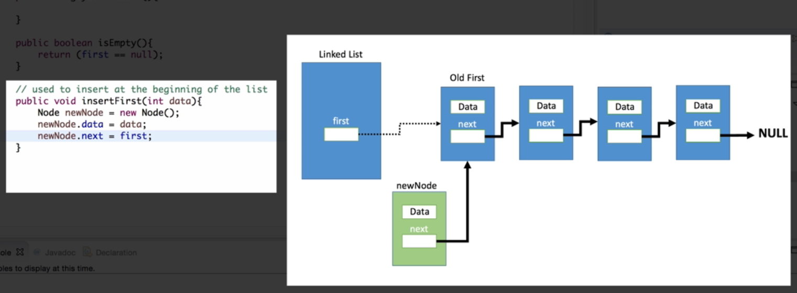
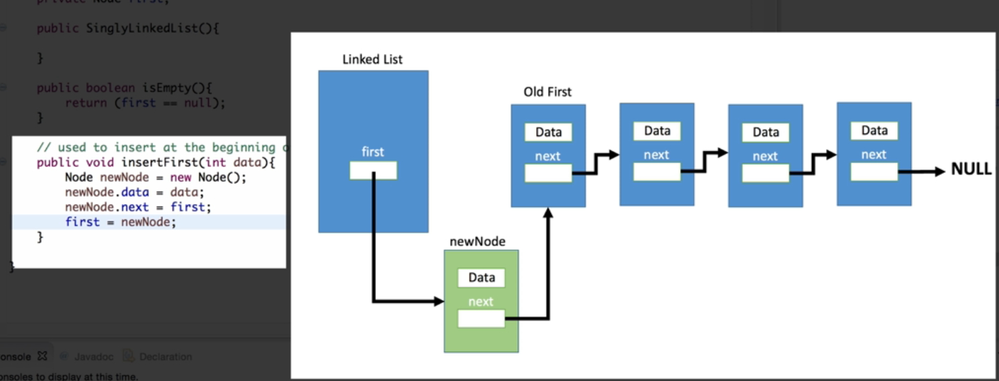
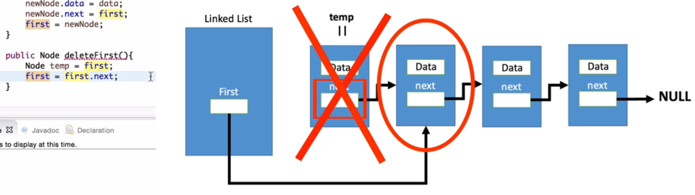
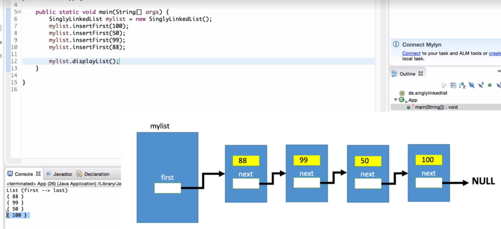

# insert-step1

新增時先把新建立的 Node指向舊的 Node

## insert-step2

接著將 list內第一個 Node指向新建立的 Node，

這樣就完成了替換。

## -----------------------------

## delete

將第一個 Node指向要刪除 Node的下一個 Node，就完成刪除 Node的動作。

## ------------------------------

## result

