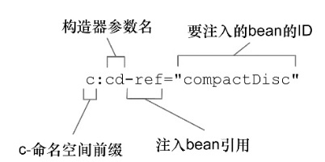

# 顯式：XML配置

### 最簡單的XML配置：

```xml
<?xml version="1.0" encoding="UTF-8"?>
<beans xmlns="http://www.springframework.org/schema/beans"
       xmlns:xsi="http://www.w3.org/2001/XMLSchema-instance"
       xsi:schemaLocation="http://www.springframework.org/schema/beans
                           http://www.springframework.org/schema/beans/spring-beans.xsd">
    <!-- TODO -->
</beans>
```

### 簡單聲明一個Bean的方式：

```xml
<bean class="org.soundSystem.SgtPeppers"/>
```

若沒有給予ID，spring會自動根據類的全名來命名：「org.soundSystem.SgtPeppers#0」，如果有聲明了另外一個SgtPeppers則會是：「org.soundSystem.SgtPeppers#1」。

給予ID的方式：

```xml
<bean id="sgtP" class="org.soundSystem.SgtPeppers"/>
```

要注意的是，Bean的類型以字串方式寫在class那邊，那如果將SgtPeppers重新命名，在XML這邊無法在編譯時的檢查所發現。

### 藉由建構子初始化Bean：

> <constructor-arg>元素
>
> c-命名空間

#### 注入Bean

##### constructor-arg元素

```xml
<bean class="org.soundSystem.CdPlayer">
    <constructor-arg ref="sgt"/>
</bean>
```

##### c-命名空間

要先在xml頂部聲明

```xml
<?xml version="1.0" encoding="UTF-8"?>
<beans xmlns="http://www.springframework.org/schema/beans"
       xmlns:c="http://www.springframework.org/schema/c"
       xmlns:xsi="http://www.w3.org/2001/XMLSchema-instance"
       xsi:schemaLocation="http://www.springframework.org/schema/beans
                           http://www.springframework.org/schema/beans/spring-beans.xsd">
    <!-- TODO -->
</beans>
```

接著就可以使用

```xml
<bean class="org.soundSystem.CdPlayer"
      c:cd-ref="sgt"/>
```



使用參數位置注入

```xml
<bean class="org.soundSystem.CdPlayer"
      c:_0-ref="sgt"/>
```

#### 注入值

```java
public class CdPlayer{
    public CdPlayer(String name, String add){
    }
}
```

##### constructor-arg元素

```xml
<bean class="org.soundSystem.CdPlayer">
    <constructor-arg value="Colin"/>
    <constructor-arg value="100 Taipei St"/>
</bean>
```

##### c-命名空間

```xml
<bean class="org.soundSystem.CdPlayer" 
      c:name="Colin" 
      c:add="100 Taipei St"/>
```

在注入Bean與注入值的時候[constructor-arg元素]與[c-命名空間]的功能都是相同的，但有一種情況是只有[]

[constructor-arg元素]能做到的：注入集合。