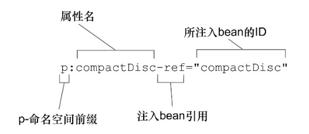

# 顯式：XML配置

### 最簡單的XML配置：

```xml
<?xml version="1.0" encoding="UTF-8"?>
<beans xmlns="http://www.springframework.org/schema/beans"
       xmlns:xsi="http://www.w3.org/2001/XMLSchema-instance"
       xsi:schemaLocation="http://www.springframework.org/schema/beans
                           http://www.springframework.org/schema/beans/spring-beans.xsd">
    <!-- TODO -->
</beans>
```

----

### 簡單聲明一個Bean的方式：

```xml
<bean class="org.soundSystem.SgtPeppers"/>
```

若沒有給予ID，spring會自動根據類的全名來命名：「org.soundSystem.SgtPeppers#0」，如果有聲明了另外一個SgtPeppers則會是：「org.soundSystem.SgtPeppers#1」。

給予ID的方式：

```xml
<bean id="sgtP" class="org.soundSystem.SgtPeppers"/>
```

要注意的是，Bean的類型以字串方式寫在class那邊，那如果將SgtPeppers重新命名，在XML這邊無法在編譯時的檢查所發現。

----

### 藉由建構子初始化Bean：

> \<constructor-arg\>元素
>
> c-命名空間

#### 注入Bean

##### \<constructor-arg\>元素

```xml
<bean class="org.soundSystem.CdPlayer">
    <constructor-arg ref="sgt"/>
</bean>
```

##### c-命名空間

要先在xml頂部聲明

```xml
<?xml version="1.0" encoding="UTF-8"?>
<beans xmlns="http://www.springframework.org/schema/beans"
       xmlns:c="http://www.springframework.org/schema/c"
       xmlns:xsi="http://www.w3.org/2001/XMLSchema-instance"
       xsi:schemaLocation="http://www.springframework.org/schema/beans
                           http://www.springframework.org/schema/beans/spring-beans.xsd">
    <!-- TODO -->
</beans>
```

接著就可以使用

```xml
<bean class="org.soundSystem.CdPlayer"
      c:cd-ref="sgt"/>
```


使用參數位置注入

```xml
<bean class="org.soundSystem.CdPlayer"
      c:_0-ref="sgt"/>
```

#### 注入值

```java
public class CdPlayer{
    public CdPlayer(String name, String add){
    }
}
```

##### \<constructor-arg\>元素

```xml
<bean class="org.soundSystem.CdPlayer">
    <constructor-arg value="Colin"/>
    <constructor-arg value="100 Taipei St"/>
</bean>
```

##### c-命名空間

```xml
<bean class="org.soundSystem.CdPlayer" 
      c:name="Colin" 
      c:add="100 Taipei St"/>
```

在注入Bean與注入值的時候\<constructor-arg元素\>與[c-命名空間]的功能都是相同的，但有一種情況是只有

\<constructor-arg元素\>能做到的：注入集合。

### 注入集合

```java
public class CdPlayer{

    public CdPlayer(String name, String add, List<String> books){

    }
}
```

給予null：

```xml
<bean class="org.soundSystem.CdPlayer">
    <constructor-arg value="Colin"/>
    <constructor-arg value="100 Taipei St"/>
    <constructor-arg ><null/></constructor-arg>
</bean>
```

注入list：

```xml
<bean class="org.soundSystem.CdPlayer">
    <constructor-arg value="Colin"/>
    <constructor-arg value="100 Taipei St"/>        
    <constructor-arg>
        <list>
            <value>How to Success</value>
            <value>My Fight</value>
        </list>
    </constructor-arg>
</bean>
```

list裡面若是類別，則可以使用ref

```xml
<bean class="org.soundSystem.CdPlayer">
    <constructor-arg value="Colin"/>
    <constructor-arg value="100 Taipei St"/>        
    <constructor-arg>
        <list>
            <ref bean="1St Book">
            <ref bean="2nd Book">
        </list>
    </constructor-arg>
</bean>
```

----

### 使用屬性注入，setter

##### 沒有集合的範例：

```java
public class CdPlayer{

    private CompactDisc disc;

    public void setDisc(CompactDisc disc) {
        this.disc = disc;
    }
}
```

\<property\>元素注入

```xml
<bean class="org.soundSystem.CdPlayer">
    <property name="disc" ref="sgt"/>
</bean>
```

p-命名空間注入

```xml
<bean class="org.soundSystem.CdPlayer" 
      p:disc-ref="sgt"/>
```



##### 有集合的範例：

```java
public class CdPlayer{

    private String name;
    private String add;
    private List<String> books;

    public void setName(String name) {
        this.name = name;
    }
    public void setAdd(String add) {
        this.add = add;
    }
    public void setBooks(List<String> books) {
        this.books = books;
    }
}
```

\<property\>元素注入

```xml
<bean class="org.soundSystem.CdPlayer">
    <property name="name" value="Colin"/>
    <property name="add" value="100 Taiper"/>
    <property name="books">
        <list>
            <value>1St Book</value>
            <value>2St Book</value>
        </list>
    </property>
</bean>
```

p-命名空間注入 mix \<property\>元素注入

```xml
<bean class="org.soundSystem.CdPlayer" 
      p:name="Colin" 
      p:add="100 Taipei St">       
    <property name="books">
        <list>
            <value>1St Book</value>
            <value>2St Book</value>
        </list>
    </property>
</bean>
```

雖然不能使用[p-命名空間]來注入集合，但可以搭配[util-命名空間]使用

```xml
<?xml version="1.0" encoding="UTF-8"?>
<beans xmlns="http://www.springframework.org/schema/beans"
       xmlns:p="http://www.springframework.org/schema/p"
       xmlns:util="http://www.springframework.org/schema/util"
       xmlns:xsi="http://www.w3.org/2001/XMLSchema-instance"
       xsi:schemaLocation="http://www.springframework.org/schema/beans
                           http://www.springframework.org/schema/beans/spring-beans.xsd">
    <util:list id="books">
        <value>1St Book</value>
        <value>2St Book</value>
    </util:list>
  
    <bean class="org.soundSystem.CdPlayer"
          p:name="Colin"
          p:add="100 Taipei St" 
          p:books-ref="books"/>  
</beans>
```

