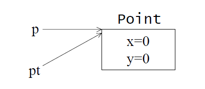
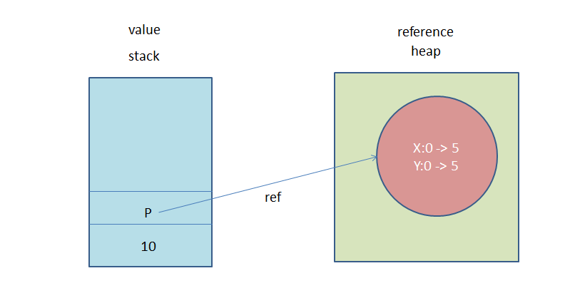

<h1>引數以call by value傳遞，而不是call by reference</h1>

```java
public void modifyPoint(Point pt, int j){
     pt.setLocation(...);
}
```

引數：pt, j
參數：Point, int

1.modifyPoint()是在與「Point物件的reference複件」打交道。<br/>
2.Java以by value方式傳遞引數 -> Java以by value方式傳遞 object reference(參考實踐8)。<br/>
3.當Point物件(p)從別的地方傳入modifyPoint()，傳遞的是p的複件，所以modifyPoint()是在與同一個物件打交道，只不過透別別名是pt罷了。



如果不想在modifyPoint()改變Point物件，有兩種辦法：<br/>
1.對modifyPoint()傳遞一個Point物件的克隆件(clone：參考實踐64,66)<br/>
2.另Point物件成為immutable(不可變的)，參考實踐65。<br/>



補充：<a href='https://thisworldmyworld.blogspot.tw/2009/12/blog-post_08.html'>引數vs參數</a>

```java
public static void getName(String a){
     ....
}
getName("Colin");
參數：String
引數："Colin"
以寫方法的角度來說，所定義需要傳進來的叫做參數；
以使用方法的角度來說，傳進去的叫引數。
value = object reference 的 value (??)
object reference(門牌號碼) -> 指向 reference(實體位置)
```