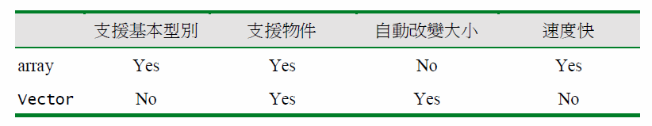

<h1>在arrays 和 vectors 之間慎重選擇</h1>

<a href='http://www.importnew.com/15702.html'>ArrayList vs LinkedList vs Vector_1</a>

<a href='http://www.cnblogs.com/wanlipeng/archive/2010/10/21/1857791.html'>ArrayList vs LinkedList vs Vector_2</a>

<ul>

<li>1.5 支持 Autoboxing，Vectory  會變相支持基本型別。</li>

<li>塞入arraylist超過大小時，會再建立一個長度更大的新arraylist，再將原本的資料跟新資料塞進新的arraylist，長大跟縮小都會做一樣的事。</li>

<li>快速隨機訪問，可以快速取得arraylist.get(7)。非線程安全。</li>

<li>linkedlist要訪問linkedlist.get(7)得從第0個一路訪問到第7個，速度會比arraylist慢。</li>

<li>vector：線程安全，長大縮小的速度比arraylist快。</li>

</ul>

vector屬於list的一員。

1.vector是thread safe的；而arraylist不是。<br/>

2.優先使用arraylist，除非有多線程的需求。<br/>

arraylist在多線程想做到thread safe的修改：

```java
List list = Collections.synchronizedList(new ArrayList(…));
```

