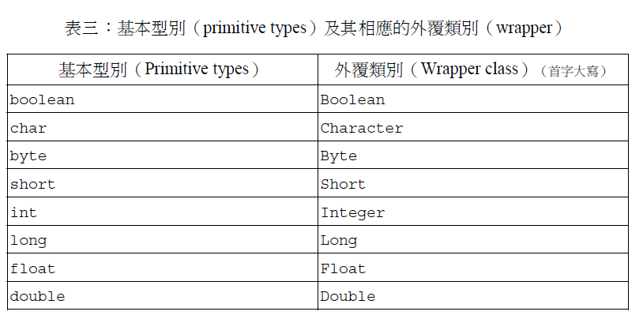
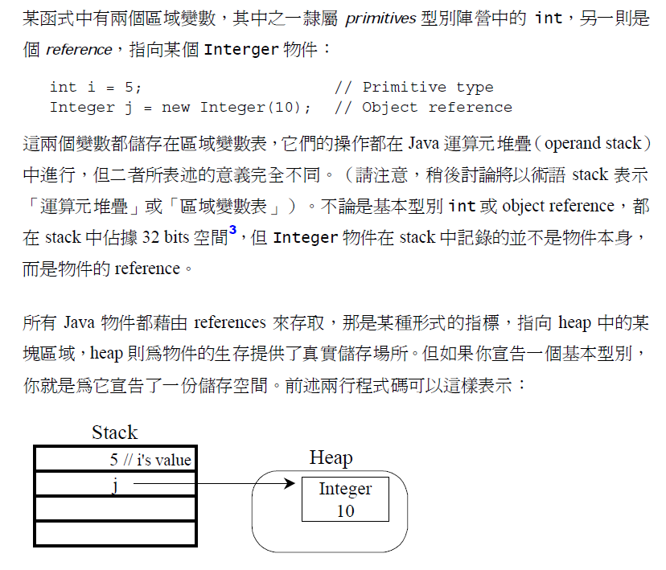
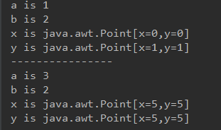
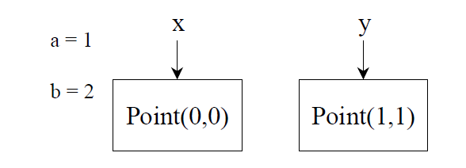
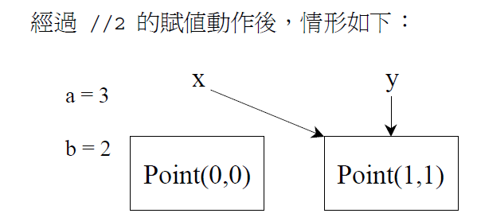
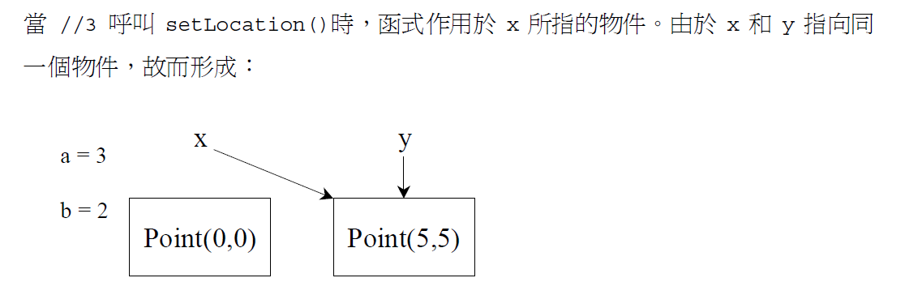

<h1>區分reference type 和primitive type</h1>

輸出結果：

賦值使得等號(=)左側的值等於右側的值，對於a,b這種的primitive型別而言，沒甚麼問題。 
但對於non-primitive型別，例如上述的Point物件，*賦值動作所修改的是object reference而不是object本身*。

x = y，由於x,y都是object reference，它們現在均指向(代表)同一個物件(object)，於是對x的任何修改也同時修改了y。

