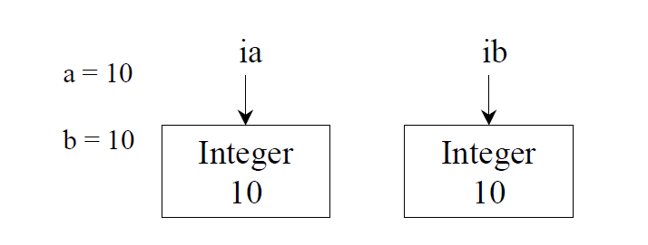

# 區分 == 和 equals

'==' -> 測試兩個基本型別是否完全相等；或測試兩個object references是否指向同一物件。

'equals()' -> 比較兩個物件是否一致(same)，基準點是其屬性(attributes，物件的實質內容，也就是資料欄位，field)

a,b 是 primitive 型別；

ia,ib 是 object reference，實際上指向兩個其[值為10的Integer物件]

不同型別的比較，程式會將int a 晉升為一個float，其值從10變化為10.0，並認為a,b的值相等；但是ia,ib隸屬不同的classes。

補充：

<a href='https://openhome.cc/Gossip/JavaGossip-V1/ImmutableString.htm'>StringPool</a>

在Java中，會維護一個String Pool，對於一些可以共享的字串物件，會先在String Pool中查找是否存在相同的String內容（字元相同），如果有就直接傳回，而不是直接創造一個新的String物件，以減少記憶體的耗用。

API沒有提供可以直接訪問string pool的方式。

<a href='https://letslearnjava.quora.com/String-Intern-How-to-check-String-Pool-Contents'>String Intern / How to check String Pool Contents?</a>

<a href='http://www.journaldev.com/797/what-is-java-string-pool'>What is Java String Pool?</a>

<a href='http://fanli7.net/a/JAVAbiancheng/JAVAzonghe/20160408/558427.html'>LongCache and IntegerCache</a>