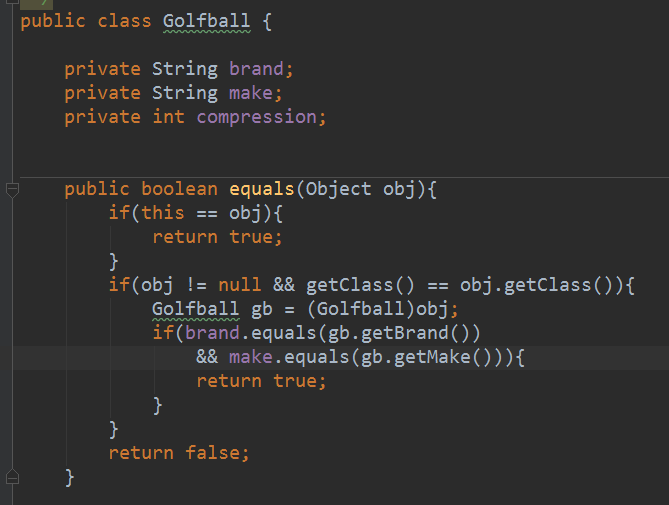

# 不要依賴equals()的預設實作品

Java的包裹型別都提供了自己的equals()實作，例如Integer，所以Integer可以直接用equals()比較。

java.lang.Object的預設equals()只檢查了object reference是否指向同一個物件。

而所有的object都繼承自java.lang.Object，所以若要比對兩個物件的內容是否相等，就得自己實作equals();

實作方式1：

不一定要檢查所有欄位，只檢查必要欄位即可

缺點：更改屬性的型別(例如String -> StringBuffer)就會讓已寫好的equals()失效。

解決方式：

1.回到使用String。

最快，但是無法用到StringBuffer的優勢。

2.修改 Golfball的equals()，使之先將StringBuffer轉換成String，在乎叫equals()。

每次對Stringbuffer呼叫toString()都伴隨產生一個String物件，代價太高了。

3.撰寫一個自己的StringBuffer class，其中包含equals()。

需要多做一切事情，但是能充分利用StringBuffer的優點。

4.放棄equals()，撰寫自己的compare函式，用它來比較StringBuffer物件的相等性。

不必另外建立一個Class來比較兩個StringBuffer物件；缺點是必須修改Golfbal的equals()，使之呼叫compare()函式，代替原本呼叫的equals()，日後又轉回使用String物件時，Golfball的equals()也必須同時修改。

結論：

1. 若想要比較物件是否相等，其class有責任提供一個正確的equals()。
2. 在呼叫equals()之前，應先檢查class時做了equals()。
3. 如果沒有實作equals()，請先判斷java.lang.Object的預設equals()能否勝任。
4. 如果無法勝任，就應該在某個外覆類別(wrapper class)或subclass中撰寫自己的equals()。

補充：

<a href='https://puremonkey2010.blogspot.tw/2011/11/java-string-stringbuffer-stringbuilder.html'>String_vs_StringBuffer_vs_StringBuilder1</a>

<a href='http://sabaao.blogspot.tw/2013/10/java-stringstringbufferstringbuilder.html'>String vs StringBuffer vs StringBuilder2</a>