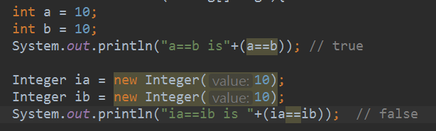

# 認識異常控制流(exception control flow)

異常發生，控制流就會轉移到以下三者之一：

- catch bock(捕獲區段)
- finally block(終結區域)
- calling method(呼叫端)

----------------

- 在try區段內拋出異常，將會發生：
- 如果同時存在catch區段和finally區段，控制流會先轉移到catch區段，在跳轉到finally區段。
- 如果沒有catch區段，控制流便移轉到finally區段。

--------------------------

Java支援垃圾回收，函式無論是正常結束，或因異常被迫退哩，該函示所創建的所有物件都會自動被解除引用(unreferenced)，因此不需要手動對這些object references解除引用。但必須明確清理non-memory資源。

------------

[item16](../../Chapter2_物件與相等性/Item14_在equals()中謹慎使用instanceof/14note.md)

